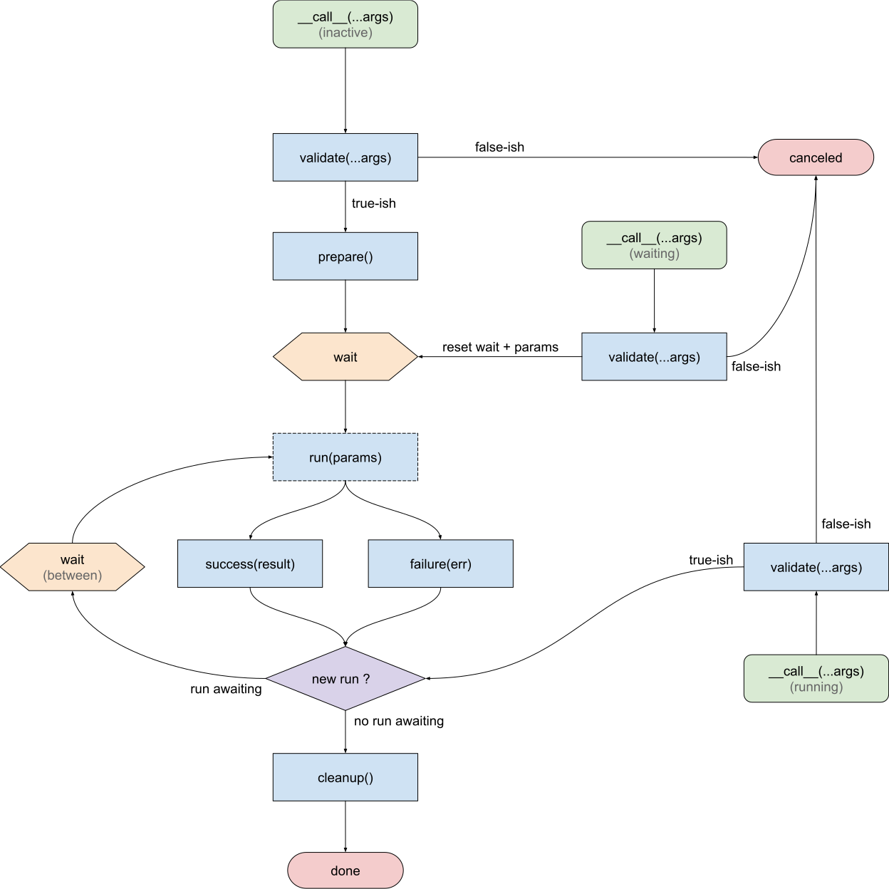

Async Debounce
==============

When you allow your user to do something that requires to call the API, you
need a simple way to avoid concurrent execution as well as safe signals to
change the UI to display loaders or react to errors.

Imagine the case of a Google-like "instant search" field. The flow you have in
mind is:

1. Wait for user input
2. Display the UI loader
3. Fetch the results
4. Display the results
5. Hide the UI loader

Of course, it's never so simple. There is a lot of edge cases. After
factorizing async actions in several projects, the following flow emerges:



While this flow can hold the mental model described above, it also accounts
for all the edge cases like:

- What if there is new input while the load is happening?
- What if there is an error?
- How to wait before doing the first query?


## Usage

In order to use `Debounce` all you need is

1. Create an instance
2. Generate a debounced function


### Full example

You can have a look at a [full example](../demo/Debounce.vue) to see an
*in-situ* use of `Debounce`. The following documentation will explore precise
points but does not give the big picture (as it is clearly shown in the demo).


### Constructor

```javascript
import {Debounce} from 'wasync';
const deb = new Debounce({
    wait: 300,
    waitBetween: 0,
});
```

- `wait` *(optional, default = 300)* &mdash; Milliseconds to wait before
  calling `run()`
- `waitBetween` *(optional, default = 0)* &mdash; Milliseconds to wait between
  two subsequent calls to `run()` 
  

### `func()`

This creates a debounced function by composing all the provided hooks. All
hooks are optional, except `run()` which is mandatory. The `this` value bound
to the hooks is forwarded from the debounced function.

#### `run(params)` &mdash; mandatory

Core function that will be executed. It will never run twice in parallel.

- If it returns a promise, the promise will be awaited
- The returned/resolved value will be passed to `success()`
- The raised exception/reject value will be passed to `failure()`
- `params`, the first and only argument, the return value of `validate()`

Also, **do not** apply the received data onto your UI from `run()` as in the
future some `run()` might be discarded. Instead, do that in `success()`.

#### `validate(...args)`

Validates the call. It has two functions

- **Validates** the call by whichever way you see fit. `...args` are the
  arguments of the debounced function. You can also access `this`. In order
  to reject the call, return a false-ish value.
- **Generates the `params`** that will be given to `run()`. The return value
  from `validate()` will be used as `params` when calling `run()`. Returned
  value must not mutate while the code is running. In other terms, if you're
  returning an object (maybe something like `return this.queryParams`) then you
  **need to copy it** otherwise the results might be unexpected.
  
#### `prepare()` and `cleanup()`

Those hooks are called without arguments. You can use them to prepare and
cleanup your UI, by example by displaying then hiding a loader.

#### `sucess(result)`

If `run()` is executed without issues, the return/resolved value of `run()` is
passed as `reuslt` to the `success()` hook. This hook is free to do whatever it
wants to handle the received data. Typically, assign the results to a property
of `this`.

#### `failure(error)`

If `run()` raised an exception or was rejected then the exception/rejected
value will be passed as `error` to `failure()`. That is where you handle
errors. Please note that an error does not mean that everything is broken,
maybe only one request failed and another one will be ongoing soon.


### Automatic instantiation

In the case of VueJS components, you cannot simply do a `new Debounce()` and
be done with it. Indeed, you need a new `Debounce` instance for each component
instance.

To that purpose exists the `ObjectDebounce` class. It works the same way
as `Debounce` except that it will automatically attach and create an instance
to each new `this` value used to call the debounced function.

The attached instance will be stored into the `prop` property, which is a
parameter to the `ObjectDebounce` constructor. If you have the need of two
`Debounce` instances (because you have two distinct actions) on the same
component, you **need** to set a different `prop` for both of them.

Here is a small code example inspired by the `Debounce.vue` file:

```javascript
        search: new ObjectDebounce({prop: 'deb'}).func({
            // ...
        })
```

As you can see the usage is completely identical to `Debounce`, except that
you can specify a `prop` argument (which is optional and defaults to
`'$wasyncDebounce'`)
